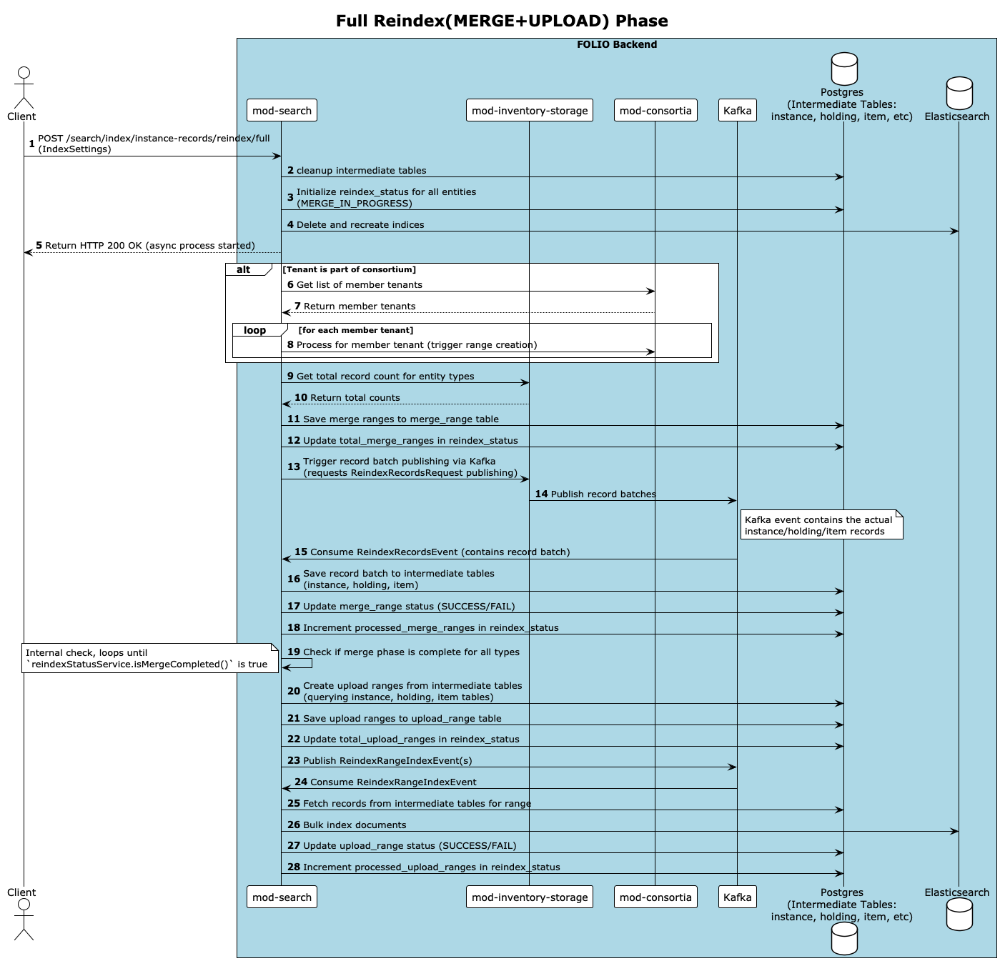

# mod-search

Copyright (C) 2020-2023 The Open Library Foundation

This software is distributed under the terms of the Apache License,
Version 2.0. See the file "[LICENSE](LICENSE)" for more information.

## Table of contents

- [Introduction](#introduction)
- [Compiling](#compiling)
- [Running it](#running-it)
- [Docker](#docker)
- [Multi-language search support](#multi-language-search-support)
  * [Adding new languages via REST](#adding-new-languages-via-rest)
  * [Defining initial languages via ENV variable](#defining-initial-languages-via-env-variable)
- [Deploying the module](#deploying-the-module)
  * [Configuring Elasticsearch](#configuring-elasticsearch)
    + [Configuring on-premise Elasticsearch instance](#configuring-on-premise-elasticsearch-instance)
    + [Recommended production set-up](#recommended-production-set-up)
  * [Environment variables](#environment-variables)
  * [Configuring spring-boot using JAVA_OPTIONS](#configuring-spring-boot)
  * [Configuring connection to elasticsearch](#configuring-connection-to-elasticsearch)
  * [Tenant attributes](#tenant-attributes)
- [Data Indexing](#data-indexing)
  * [Recreating Elasticsearch index](#recreating-elasticsearch-index)
  * [Updating index settings](#updating-index-settings)
  * [Monitoring reindex process](#monitoring-reindex-process)
- [Indexing of Instance Records](#indexing-of-instance-records)
- [API](#api)
  * [CQL support](#cql-support)
    + [CQL query operators](#cql-query-operators)
    + [CQL query modifiers](#cql-query-modifiers)
  * [Search API](#search-api)
    + [Searching and filtering](#searching-and-filtering)
      - [Matching all records](#matching-all-records)
      - [Matching undefined or empty values](#matching-undefined-or-empty-values)
      - [Search by all field values](#search-by-all-field-values)
      - [Instance search options](#instance-search-options)
      - [Holdings search options](#holdings-search-options)
      - [Item search options](#item-search-options)
      - [Authority search options](#authority-search-options)
      - [Contributors search options](#contributors-search-options)
    + [Search Facets](#search-facets)
      - [Instance facets](#instance-facets)
      - [Holdings facets](#holdings-facets)
      - [Item facets](#item-facets)
      - [Authority facets](#authority-facets)
      - [Contributors facets](#contributors-facets)
    + [Sorting results](#sorting-results)
      - [Instance sort options](#instance-sort-options)
      - [Authority sort options](#authority-sort-options)
  * [Browse API](#browse-api)
  * [Resource IDs streaming API](#resource-ids-streaming-api)
    + [Create Job](#create-job)
    + [Retrieve ids](#retrieve-ids)
- [Additional Information](#additional-information)
  * [Issue tracker](#issue-tracker)
  * [API Documentation](#api-documentation)
  * [Code analysis](#code-analysis)
  * [Download and configuration](#download-and-configuration)
  * [Development tips](#development-tips)

## Introduction

This module provides a search functionality for instance and authorities via REST API. It uses
[The Contextual Query Language](https://www.loc.gov/standards/sru/cql/) as a formal language to query
records using filters, boolean conditions, etc.

mod-search works with either Elasticsearch and OpenSearch, however,
many variables still have Elasticsearch in their name for backwards compatibility.



## Compiling

```shell
mvn install
```

See that it says "BUILD SUCCESS" near the end.

By default, the integration tests run against an OpenSearch server.
To run them against an Elasticsearch server use

```shell
SEARCH_ENGINE_DOCKERFILE="docker/elasticsearch8/Dockerfile" mvn install
```

or run [GitHub Action elasticsearch.yml](.github/workflows/elasticsearch.yml).

The GitHub Action automatically runs whenever a commit is pushed to the master branch.

## Running it

Run locally with proper environment variables set (see
[Environment variables](#environment-variables) below) on listening port 8081 (default
listening port):

```
KAFKA_HOST=localhost KAFKA_PORT=9092 \
   java -Dserver.port=8081 -jar target/mod-search-*.jar

```

## Docker

Build the docker container with:

```shell
docker build -t mod-search .
```

Test that it runs with:

```shell
docker run -t -i -p 8081:8081 mod-search
```

## Multi-language search support

Each tenant is allowed to pick up to **5** languages from pre-installed list for multi-language indexes (e.g. title,
contributors, etc.).
This can be done via following API (`languageAnalyzer` field is optional):
`POST /search/config/languages`

```json
{
  "code": "eng",
  "languageAnalyzer": "english"
}
```

The `code` here is an ISO-639-2/B three-letter code. Here is the list of pre-installed languages analyzers:

- ara
- ger
- eng
- spa
- fre
- heb
- ita
- jpn
- kor (default analyzer: seunjeon_analyzer, alternative for k8s and on-premise deployment - nori)
- rus
- swe
- chi

### Adding new languages via REST

It is allowed to add new languages via rest endpoint `/search/config/languages`.
**Please note, when you add a new language, a whole reindex is required in order to
apply new configuration**.

### Defining initial languages via ENV variable

It is possible to define initial languages via `INITIAL_LANGUAGES` env variable.
These languages will be added on tenant init and applied to index. Example usage:
`INITIAL_LANGUAGES=eng,fre,kor,chi,spa`. If the variable is not defined, only
`eng` code is added.

## Deploying the module

### Configuring Elasticsearch

#### Configuring on-premise Elasticsearch instance

It is required to install some required plugins for your search engine instance, here is the list:

* analysis-icu
* analysis-kuromoji
* analysis-smartcn
* analysis-nori
* analysis-phonetic

You can find sample Dockerfile in [docker/opensearch/Dockerfile] or install plugins manually:

```shell
${ES_HOME}/bin/opensearch-plugin install --batch \
  analysis-icu \
  analysis-kuromoji \
  analysis-smartcn \
  analysis-nori \
  analysis-phonetic
```

See also [Install OpenSearch/Docker Image](https://opensearch.org/docs/latest/opensearch/install/docker/).

There is an alternative Elasticsearch image from
Bitnami - [bitnami/elasticsearch](https://hub.docker.com/r/bitnami/elasticsearch),
that does not require extending dockerfile but has an env variable `ELASTICSEARCH_PLUGINS` to specify plugins to
install.

For production installations it is strongly recommended enabling security for instance and set-up user/password. The
user
must have at least following permissions:

* Create/delete/update index and mappings for it.
* Create/update/delete documents in index.

#### Recommended production set-up

The data nodes OpenSearch configuration completely depends on the data.
If there are 7 mln of instances the configuration with 2 nodes with 8Gb RAM and 500 Gb disk (AWS m5.large) works well.
The nodes were both master and data node. We performed performance tests for this configuration, and it showed good
results.
We would recommend to performing additional performance testing (try to reindex and search with different
configurations)
with different type of nodes, and see what configuration is sufficient for what data volume.

Also, for fault tolerance OpenSearch requires dedicated master nodes (not to have quorum problem which is called split
brain)
with less powerful configuration (
see [High availability](https://www.elastic.co/guide/en/cloud-enterprise/current/ece-ha.html)
and [Cross-cluster replication](https://docs.aws.amazon.com/opensearch-service/latest/developerguide/replication.html)).

### Environment variables

| Name                                               | Default value                                        | Description                                                                                                                                                                           |
|:---------------------------------------------------|:-----------------------------------------------------|:--------------------------------------------------------------------------------------------------------------------------------------------------------------------------------------|
| DB_HOST                                            | postgres                                             | Postgres hostname                                                                                                                                                                     |
| DB_PORT                                            | 5432                                                 | Postgres port                                                                                                                                                                         |
| DB_USERNAME                                        | postgres                                             | Postgres username                                                                                                                                                                     |
| DB_PASSWORD                                        | postgres                                             | Postgres username password                                                                                                                                                            |
| DB_DATABASE                                        | okapi_modules                                        | Postgres database name                                                                                                                                                                |
| ELASTICSEARCH_URL                                  | http://elasticsearch:9200                            | Elasticsearch URL                                                                                                                                                                     |
| ELASTICSEARCH_USERNAME                             | -                                                    | Elasticsearch username (not required for dev envs)                                                                                                                                    |
| ELASTICSEARCH_PASSWORD                             | -                                                    | Elasticsearch password (not required for dev envs)                                                                                                                                    |
| ELASTICSEARCH_COMPRESSION_ENABLED                  | true                                                 | Specify if Elasticsearch request/response compression enabled                                                                                                                         |
| ELASTICSEARCH_SERVER                               | false                                                | Specify whether it is Elasticsearch(true) or Opensearch(false)                                                                                                                        |
| KAFKA_HOST                                         | kafka                                                | Kafka broker hostname                                                                                                                                                                 |
| KAFKA_PORT                                         | 9092                                                 | Kafka broker port                                                                                                                                                                     |
| KAFKA_SECURITY_PROTOCOL                            | PLAINTEXT                                            | Kafka security protocol used to communicate with brokers (SSL or PLAINTEXT)                                                                                                           |
| KAFKA_SSL_KEYSTORE_LOCATION                        | -                                                    | The location of the Kafka key store file. This is optional for client and can be used for two-way authentication for client.                                                          |
| KAFKA_SSL_KEYSTORE_PASSWORD                        | -                                                    | The store password for the Kafka key store file. This is optional for client and only needed if 'ssl.keystore.location' is configured.                                                |
| KAFKA_SSL_TRUSTSTORE_LOCATION                      | -                                                    | The location of the Kafka trust store file.                                                                                                                                           |
| KAFKA_SSL_TRUSTSTORE_PASSWORD                      | -                                                    | The password for the Kafka trust store file. If a password is not set, trust store file configured will still be used, but integrity checking is disabled.                            |
| KAFKA_EVENTS_CONSUMER_PATTERN                      | (${folio.environment}\.\)(.*\.)inventory\.(instance\ | holdings-record\                                                                                                                                                                      |item\|bound-with) | Custom subscription pattern for Kafka consumers.                                                                                                                                      |
| KAFKA_EVENTS_CONCURRENCY                           | 2                                                    | Custom number of kafka concurrent threads for message consuming.                                                                                                                      |
| KAFKA_AUTHORITIES_CONSUMER_PATTERN                 | (${folio.environment}\.)(.*\.)authorities\.authority | Custom subscription pattern for Kafka authority message consumers.                                                                                                                    |
| KAFKA_AUTHORITIES_CONCURRENCY                      | 1                                                    | Custom number of kafka concurrent threads for authority message consuming.                                                                                                            |
| KAFKA_LOCATION_CONCURRENCY                         | 1                                                    | Custom number of kafka concurrent threads for inventory.location, inventory.campus, inventory.institution and inventory.library message consuming.                                    |
| KAFKA_LINKED_DATA_CONCURRENCY                      | 1                                                    | Custom number of kafka concurrent threads for linked data message consuming.                                                                                                          |
| KAFKA_REINDEX_RANGE_INDEX_CONCURRENCY              | 1                                                    | Custom number of kafka concurrent threads for `search.reindex.range-index` message consuming.                                                                                         |
| KAFKA_REINDEX_RANGE_INDEX_TOPIC_PARTITIONS         | 16                                                   | Amount of partitions for `search.reindex.range-index` topic.                                                                                                                          |
| KAFKA_REINDEX_RANGE_INDEX_TOPIC_REPLICATION_FACTOR | -                                                    | Replication factor for `search.reindex.range-index` topic.                                                                                                                            |
| KAFKA_REINDEX_RECORDS_CONCURRENCY                  | 2                                                    | Custom number of kafka concurrent threads for `inventory.reindex-records` message consuming.                                                                                          |
| KAFKA_CONSUMER_MAX_POLL_RECORDS                    | 200                                                  | Maximum number of records returned in a single call to poll().                                                                                                                        |
| KAFKA_RETRY_INTERVAL_MS                            | 2000                                                 | Specifies time to wait before reattempting query.                                                                                                                                     |
| KAFKA_RETRY_DELIVERY_ATTEMPTS                      | 6                                                    | Specifies how many queries attempt to perform after the first one failed.                                                                                                             |
| INDEXING_DATA_FORMAT                               | smile                                                | Format for passing data to elasticsearch (json/smile)                                                                                                                                 |
| INITIAL_LANGUAGES                                  | eng                                                  | Comma separated list of languages for multilang fields see [Multi-lang search support](#multi-language-search-support)                                                                |
| MAX_SUPPORTED_LANGUAGES                            | 5                                                    | Provides the maximum number of supported languages                                                                                                                                    |
| SYSTEM_USER_USERNAME                               | mod-search                                           | Username for `mod-search` system user                                                                                                                                                 |
| SYSTEM_USER_PASSWORD                               | -                                                    | Password for `mod-search` system user (not required for dev envs)                                                                                                                     |
| OKAPI_URL                                          | -                                                    | OKAPI URL used to login system user, required                                                                                                                                         |
| ENV                                                | folio                                                | The logical name of the deployment, must be unique across all environments using the same shared Kafka/Elasticsearch clusters, `a-z (any case)`, `0-9`, `-`, `_` symbols only allowed |
| SEARCH_BY_ALL_FIELDS_ENABLED                       | false                                                | Specifies if globally search by all field values must be enabled or not (tenant can override this setting)                                                                            |
| BROWSE_SUBJECTS_ENABLED                            | true                                                 | Specifies if globally browse instance subject feature is enabled                                                                                                                      |
| BROWSE_CONTRIBUTORS_ENABLED                        | true                                                 | Specifies if globally browse instance contributor feature is enabled                                                                                                                  |
| BROWSE_CLASSIFICATIONS_ENABLED                     | true                                                 | Specifies if globally browse instance classification feature is enabled                                                                                                               |
| BROWSE_CALL_NUMBERS_ENABLED                        | true                                                 | Specifies if globally browse instance call-number feature is enabled                                                                                                                  |
| SCROLL_QUERY_SIZE                                  | 1000                                                 | The number of records to be loaded by each scroll query. 10000 is a max value                                                                                                         |
| STREAM_ID_RETRY_INTERVAL_MS                        | 1000                                                 | Specifies time to wait before reattempting query.                                                                                                                                     |
| STREAM_ID_RETRY_ATTEMPTS                           | 3                                                    | Specifies how many queries attempt to perform after the first one failed.                                                                                                             |
| STREAM_ID_CORE_POOL_SIZE                           | 2                                                    | The number of threads to keep in the pool, even if they are idle.                                                                                                                     |
| STREAM_ID_MAX_POOL_SIZE                            | 2                                                    | The maximum number of threads to allow in the pool.                                                                                                                                   |
| STREAM_ID_QUEUE_CAPACITY                           | 500                                                  | The capacity of the queue.                                                                                                                                                            |
| STREAM_ID_JOB_EXPIRATION_DAYS                      | 7                                                    | Number of days after which the stream id job will be considered expired and cleaned up.                                                                                               |
| SEARCH_QUERY_TIMEOUT                               | 25s                                                  | The maximum time to wait for search query response                                                                                                                                    |
| MAX_BROWSE_REQUEST_OFFSET                          | 500                                                  | The maximum elasticsearch query offset for additional requests on browse around                                                                                                       |
| SYSTEM_USER_ENABLED                                | true                                                 | Defines if system user must be created at service tenant initialization or used for egress service requests                                                                           |
| REINDEX_LOCATION_BATCH_SIZE                        | 1000                                                 | Defines number of locations to retrieve per inventory http request on locations reindex process                                                                                       |
| REINDEX_MERGE_RANGE_SIZE                           | 500                                                  | The range size that represents the number of merge entities to process during the Merge process of reindex                                                                            |
| REINDEX_UPLOAD_RANGE_SIZE                          | 1000                                                 | The range size that represents the number of upload entities to process during the Upload process of reindex                                                                          |
| REINDEX_UPLOAD_RANGE_LEVEL                         | 3                                                    | The level of deepness of upload range generator affecting the number of ranges to be generated                                                                                        |
| REINDEX_MERGE_RANGE_PUBLISHER_CORE_POOL_SIZE       | 3                                                    | The number of threads for publishing the merge ranges to keep in the pool, even if they are idle.                                                                                     |
| REINDEX_MERGE_RANGE_PUBLISHER_MAX_POOL_SIZE        | 6                                                    | The maximum number of threads for publishing the merge ranges to allow in the pool.                                                                                                   |
| REINDEX_MERGE_RANGE_PUBLISHER_RETRY_INTERVAL_MS    | 1000                                                 | The retry interval in ms for reindex merge range request publishing.                                                                                                                  |
| REINDEX_MERGE_RANGE_PUBLISHER_RETRY_ATTEMPTS       | 5                                                    | The maximum number of retries for reindex merge range request publishing.                                                                                                             |
| MAX_SEARCH_BATCH_REQUEST_IDS_COUNT                 | 20000                                                | Defines maximum batch request IDs count for searching consolidated items/holdings in consortium                                                                                       |
| INSTANCE_CHILDREN_INDEX_ENABLED                    | true                                                 | Defines if module should process subjects/contributors/classifications/call-numbers in a background                                                                                   |
| INSTANCE_CHILDREN_INDEX_DELAY_MS                   | 60000                                                | Defines the delay for scheduler that indexes subjects/contributors/classifications/call-numbers in a background                                                                       |
| SUB_RESOURCE_BATCH_SIZE                            | 100                                                  | Defines number of sub-resources to process at a time during background indexing                                                                                                       |
| STALE_LOCK_THRESHOLD_MS                            | 600000                                               | Threshold to consider a sub-resource lock as stale and eligible for release                                                                                                           |

The module uses system user to communicate with other modules from Kafka consumers.
For production deployments you MUST specify the password for this system user via env variable:
`SYSTEM_USER_PASSWORD=<password>`.

### Configuring spring-boot

Spring boot properties can be overridden using the specified environment variables, if it is not it can be done using
one of the following approaches (see also the
documentation [Spring Boot Externalized Configuration](https://docs.spring.io/spring-boot/docs/1.5.6.RELEASE/reference/html/boot-features-external-config.html)):

1. Using the environment variable `SPRING_APPLICATION_JSON` (
   example: `SPRING_APPLICATION_JSON='{"foo":{"bar":"spam"}}'`)
2. Using the system variables within the `JAVA_OPTIONS` (
   example: `JAVA_OPTIONS=-Xmx400m -Dlogging.level.org.folio.search=debug`)

### Configuring connection to elasticsearch

In order to configure connection to OpenSearch or Elasticsearch you have to provide following env variables:

* `ELASTICSEARCH_URL` - URL to OpenSearch or Elasticsearch master node (e.g. http(s)://elasticsearch:9200);
* `ELASTICSEARCH_USERNAME` - username of the user to connect to OpenSearch or Elasticsearch;
* `ELASTICSEARCH_PASSWORD` - password for the user (see
  [OpenSearch Security configuration](https://opensearch.org/docs/latest/security-plugin/configuration/index/) or
  [Secure the Elastic Stack](https://www.elastic.co/guide/en/elasticsearch/reference/current/secure-cluster.html)
  for details).

### Tenant attributes

It is possible to define specific tenant parameters during module's initialization for particular tenant.

| Tenant parameter | Default value | Description                                                                       |
|:-----------------|:-------------:|:----------------------------------------------------------------------------------|
| runReindex       |     false     | Start reindex procedure automatically after module will be enabled for the tenant |
| centralTenantId  |     null      | Central tenant Id when module is in consortia mode                                |

## Data Indexing

### Recreating Elasticsearch index

Sometimes we need to recreate OpenSearch or Elasticsearch index, for example when a breaking change introduced to index
structure (mapping). It can be fixed by running reindex request:

```http
POST [OKAPI_URL]/search/index/inventory/reindex

x-okapi-tenant: [tenant]
x-okapi-token: [JWT_TOKEN]

{
  "recreateIndex": true,
  "resourceName": "authority",
  "indexSettings": {
    "numberOfShards": 2,
    "numberOfReplicas": 4,
    "refreshInterval": 1
  }
}
```

* `resourceName` parameter is required. Possible values: `authority`, `location`,
  `linked-data-instance`, `linked-data-work`, `linked-data-hub`. Please note that `location` reindex is synchronous.
  Refer to [Indexing of Instance Records](#indexing-of-instance-records) section for reindexing of instances
* `recreateIndex` parameter is optional and equal to `false` by default. If it is equal to `true` then mod-search
  will drop existing indices for tenant and resource, creating them again. Executing request with this parameter
  equal to `true` in query will erase all the tenant data in mod-search.
* `indexSettings` parameter is optional and defines the following Elasticsearch/Opensearch index settings:
  - `numberOfShards` - the number (between 1 and 100) of primary shards for the index
  - `numberOfReplicas` - the number of replicas (between 0 and 100) each primary shard has
  - `refreshInterval` - the refresh interval reflecting how often to make new changes to the index visible to search (seconds). `-1` disables refresh.
* Please note that for `linked-data-instance`, `linked-data-work` and `linked-data-hub` resources the endpoint is used only for index recreation
  purpose and actual reindex operation is triggered through mod-linked-data.

### Updating index settings

Elasticsearch/Opensearch index settings can be updated using the following request:

```http
PUT [OKAPI_URL]/search/index/settings

x-okapi-tenant: [tenant]
x-okapi-token: [JWT_TOKEN]

{
  "resourceName": "authority",
  "indexSettings": {
    "numberOfReplicas": 4,
    "refreshInterval": 60
  }
}
```

* `resourceName` parameter is required. Possible values: `instance`, `authority`, `location`, `linked-data-instance`, `linked-data-work`, `linked-data-hub`.
* `indexSettings` parameter is optional and defines the following Elasticsearch/Opensearch index settings:
  - `numberOfReplicas` - the number of replicas (between 0 and 100) each primary shard has
  - `refreshInterval` - the refresh interval reflecting how often to make new changes to the index visible to search (seconds). `-1` disables refresh.

Index settings can also be specified during the running of reindex process which is described in [Recreating Elasticsearch index](#recreating-elasticsearch-index)
and in [Indexing of Instance Records](#indexing-of-instance-records) sections.

### Monitoring reindex process

There is no end-to-end monitoring implemented yet, however it is possible to monitor it partially. In order to check
how many records published to Kafka topic use inventory API:

```http
GET [OKAPI_URL]/authority-storage/reindex/[reindex job id]
```

_reindex job id_ - id returned by `/search/index/inventory/reindex` endpoint.

In order to estimate total records that actually added to the index, you can send a "match all" search query and check
`totalRecords`, e.g. `GET /search/authorities?query=id="*"`. Alternatively you can query Elasticsearch directly,
see [ES search API](https://www.elastic.co/guide/en/elasticsearch/reference/current/query-dsl-match-all-query.html#query-dsl-match-all-query).

## Indexing of Instance Records

The section below describes the data indexing for ```instance```, ```subject```, ```contribution``` and ```classification``` resource types.
Since ```subject```, ```contribution``` and ```classification``` are derived or child records of an Instance, in short, we are referring to
indexing of these and ```instance``` as _Indexing of Instances_ (or _Instances Indexing_) and resources as Instance resources.

This is an improved and recommended version of instances indexing than that which is achieved with
```POST [OKAPI_URL]/search/index/inventory/reindex``` and documented in [Data Indexing](#data-indexing) section

The whole indexing procedure consist of two steps:
1. Merge - building the necessary data model and collection of data in accordance with the built model
2. Upload - querying the data and adding them into OpenSearch index

Merge step can be considered as Data Aggregation or Data Reloading. We need to run this step when there is a breaking change introduced to index structure (mapping).
Normally, we run Instances indexing with this step rarely, as introducing the breaking changes does not happen that frequently. The step aggregates all instances data
available for the tenant into specific data models and keeps them there. For Create/Update/Delete operations performed on specific Instances mod-search will
update or sync the aggregated data of those specific Instances, so that the aggregated data is always actual and represents the latest state of an instance resources.

Upload step queries the aggregated data for the specific Instance resources type and then runs the indexing by populating the data into resource's OpenSearch index.

We can execute both Merge and Upload steps with so-called _full reindex_ API:
```http
POST /search/index/instance-records/reindex/full

x-okapi-tenant: [tenant]
x-okapi-token: [JWT_TOKEN]

{
  "indexSettings": {
    "numberOfShards": 2,
    "numberOfReplicas": 4,
    "refreshInterval": 1
  }
}

```
* `indexSettings` parameter is optional and defines the following Elasticsearch/Opensearch index settings:
  - `numberOfShards` - the number (between 1 and 100) of primary shards for the index
  - `numberOfReplicas` - the number of replicas (between 0 and 100) each primary shard has
  - `refreshInterval` - the refresh interval reflecting how often to make new changes to the index visible to search (seconds). `-1` disables refresh.

It runs the async process which performs both steps described above.

If Instances Indexing was performed in the past, we have aggregated data of instances stored in our models, and changes we made do not require
to perform mapping between the inventory Instance resources and OpenSearch indices then running the Merge Step in this and subsequent times is not
necessary, and we can run only Upload step. In order to do this we can call the following async API:

```http
POST /search/index/instance-records/reindex/upload

x-okapi-tenant: [tenant]
x-okapi-token: [JWT_TOKEN]

{
  "entityTypes": ["instance", "subject", "contributor", "classification", "call-number"]
}
```

We can call the above API as _upload reindex_ API as it runs only Upload step. So, the assumption for running _upload reindex_ is that Merge step was run before with _full reindex_ API.
If it is not the case or if our changes require to run the Merge step which means there are breaking changes on the mapping between the inventory Instance resources and OpenSearch indices
then _full reindex_ API.

We can specify one or many resource types in ```entityTypes``` array depending on our needs and if more than one resource type is given then upload step will run for each one of the
specified resources.

In order to monitor the async processes initiated by the above two APIs we can execute the endpoint:
```http
GET /search/index/instance-records/reindex/status
```

and it returns a response showing the status details for the latest run operations, merge and upload alike, which may look like the following:
```json
[
  {
    "entityType": "holding",
    "status": "MERGE_COMPLETED",
    "totalMergeRanges": 5,
    "processedMergeRanges": 5,
    "totalUploadRanges": 0,
    "processedUploadRanges": 0,
    "startTimeMerge": "2024-04-01T00:38:34.15755006Z",
    "endTimeMerge": "2024-04-01T00:38:35.15755006Z"
  },
  {
    "entityType": "item",
    "status": "MERGE_COMPLETED",
    "totalMergeRanges": 3,
    "processedMergeRanges": 3,
    "totalUploadRanges": 0,
    "processedUploadRanges": 0,
    "startTimeMerge": "2024-04-01T00:37:34.15755006Z",
    "endTimeMerge": "2024-04-01T00:37:35.15755006Z"
  },
  {
    "entityType": "instance",
    "status": "UPLOAD_COMPLETED",
    "totalMergeRanges": 3,
    "processedMergeRanges": 3,
    "totalUploadRanges": 2,
    "processedUploadRanges": 2,
    "startTimeMerge": "2024-04-01T00:37:34.15755006Z",
    "endTimeMerge": "2024-04-01T00:37:35.15755006Z",
    "startTimeUpload": "2024-04-01T00:37:36.15755006Z",
    "endTimeUpload": "2024-04-01T00:37:37.15755006Z"
  },
  {
    "entityType": "subject",
    "status": "UPLOAD_COMPLETED",
    "totalMergeRanges": 0,
    "processedMergeRanges": 0,
    "totalUploadRanges": 2,
    "processedUploadRanges": 2,
    "startTimeUpload": "2024-04-01T01:37:36.15755006Z",
    "endTimeUpload": "2024-04-01T01:37:37.15755006Z"
  }
]
```

When ```entityType``` has value of ```item``` or ```holding``` then we have status details of Merge step
and when ```entityType``` has value of ```subject```, ```contributor``` or ```classification``` then we have status details of Upload step.
Only for entity type of ```instance``` we can have statuses of both Merge and Upload steps.

```status``` response field can have values of ```"MERGE_IN_PROGRESS"```, ```"MERGE_COMPLETED"``` or ```"MERGE_FAILED"``` for entity types
representing Merge step and values of ```"UPLOAD_IN_PROGRESS"```, ```"UPLOAD_COMPLETED"``` or ```"UPLOAD_FAILED"``` for the entities of Upload step.

## API

### CQL support

We use CQL query for search queries,
see [documentation](https://github.com/folio-org/raml-module-builder#cql-contextual-query-language)
for more details.

In mod-search there are two main types of searchable fields:

1. _Full text_ capable fields (aka. multi-lang fields) - analyzed and preprocessed fields;
2. _Term_ fields (keywords, bool, date fields, etc.) - non-analyzed fields.

#### CQL query operators

Depending on field type, CQL operators will be handled in different ways or not supported at all.
Here is table of supported operators.

| Operator   | Full text usage                | Term field usage              | Description                                                                                                                                        |
|:-----------|:-------------------------------|:------------------------------|----------------------------------------------------------------------------------------------------------------------------------------------------|
| `all`      | `title` `all` `"semantic web"` | N/A                           | Matches a resource that has both `semantic` and `web` in the `title` field                                                                         |
| `any`      | `title` `any` `"semantic web"` | N/A                           | Matches a resource that has either of/both `semantic` or `web` in the `title` field                                                                |
| `=`        | `title = "semantic web"`       | `hrid = "hr10"`               | Has the same effect as `all` for FT fields and is the same as `==` for term fields                                                                 |
| `==`       | `title == "semantic web"`      | `hrid == "hr10"`              | Phrase match for FT fields (i.e. matches resources that contains both `semantic` and `web` exactly in the same order), exact match for term fields |
| `<>`       | `title <> "semantic web"`      | `hrid <> "hr10"`              | Matches resources that are not equal to a term                                                                                                     |
| `<`, `>`   | N/A                            | `createdDate > "2020-12-12"`  | Matches resources that has the property greater/less than the limit                                                                                |
| `<=`, `>=` | N/A                            | `createdDate <= "2020-12-12"` | Matches resources that has the property greater or eq/less or eq than the limit                                                                    |
| `*`        | `title="mode* europe*"`        | `hrid = "hr10*"`              | Allow to search by wildcard, _**NOT recommended to use for FT fields because has low performance, use full-text capabilities instead**_            |

#### CQL query modifiers

CQL operators could have modifiers that change search behaviour

| Operator | Modifier | Usage                            | Description                      |
|:---------|:---------|:---------------------------------|:---------------------------------|
| `==`     | `string` | `title ==/string "semantic web"` | Exact match for full text fields |

#### Consortium support

Consortium feature is defined automatically at runtime by calling /user-tenants endpoint.
Consortium feature on module enable is defined by 'centralTenantId' tenant parameter. Example:

```json
{
  "module_to": "mod-sample-1.3.1",
  "parameters": [
    {
      "key": "centralTenantId",
      "value": "centralTenant"
    },
    {
      "key": "loadReference",
      "value": true
    }
  ]
}
```

### Search API

| METHOD | URL                             | DESCRIPTION                                                                          |
|:-------|:--------------------------------|:-------------------------------------------------------------------------------------|
| GET    | `/search/instances`             | Search by instances and to this instance items and holding-records                   |
| GET    | `/search/authorities`           | Search by authority records                                                          |
| GET    | `/search/linked-data/instances` | Search linked data graph instance resource descriptions                              |
| GET    | `/search/linked-data/works`     | Search linked data graph work resource descriptions                                  |
| GET    | `/search/linked-data/hubs`      | Search linked data graph hub resource descriptions                                   |
| GET    | `/search/{recordType}/facets`   | Get facets where recordType could be: instances, authorities, contributors, subjects |

#### Searching and filtering

The main endpoint that provides search capabilities is `GET /search/instances`. It consumes following
request parameters:

| Name      | Required              | Default value | Description                                                                        |
|:----------|:----------------------|:--------------|:-----------------------------------------------------------------------------------|
| query     | Yes                   | -             | A CQL query to execute                                                             |
| limit     | No (default to 100)   | 100           | Maximum number of records to fetch                                                 |
| offset    | No (default to 0)     | 0             | Instructs to skip first N records that matches the query                           |
| expandAll | No (default to false) | false         | If false than only _*basic_ instance properties returned, otherwise all properties |

> *_Basic fields for instances search are following:_
> * _id_
> * _title_
> * _contributors_
> * _publication_

> *_Basic fields for authorities search are following:_
> * _id_
> * _headingType_
> * _authRefType_
> * _headingRef_
> * _sourceFileId_
> * _naturalId_

##### Matching all records

A search matching all records in the target index can be executed with a `cql.allRecords=1` (CQL standard, the fastest
option)
or a `id=*` (slower option, check all documents in index) query. They can be used alone or as part of a more complex
query.
Examples:

- `cql.allRecords=1 NOT contributors=Smith sortBy title/sort.ascending` matches all records where contributors name does
  not contain `Smith` as a word.
- `id=* NOT contributors=Smith sortBy title/sort.ascending` matches all records where contributors name does not
  contain `Smith` as a word.

##### Matching undefined or empty values

A relation does not match if the value on the left-hand side is undefined.
A negation (using NOT) of a relation matches if the value on the left-hand side is not defined or
if it is defined but doesn't match.

- `name=""` matches all records where name is defined.
- `cql.allRecords=1 NOT name=""` matches all records where name is not defined.
- `name==""` matches all records where name is defined and empty.
- `cql.allRecords=1 NOT name==""` matches all records where name is defined and not empty or where name is not defined.
- `name="" NOT name==""` matches all records where name is defined and not empty.
- `languages == "[]"` for matching records where lang is defined and an empty array

##### Search by all field values

Search by all feature is optional and disabled by default. However, it can be enabled for tenant using
following HTTP request:

`POST /search/config/features`

```json
{
  "feature": "search.all.fields",
  "enabled": true
}
```

Also, search by all fields can be enabled globally by passing to mod-search service following ENV variable:

```
SEARCH_BY_ALL_FIELDS_ENABLED=true
```

By default, indexing processors for fields `cql.allInstance`, `cql.allItems`, `cql.allHoldings` are disabled and
does not produce any values, so the following search options will return an empty result.

| Option             |       Type        | Example                          | Description                                                                       |
|:-------------------|:-----------------:|:---------------------------------|:----------------------------------------------------------------------------------|
| `cql.all`          | full-text or term | `cql.all all "web semantic"`     | Matches instances that have given text in instance, item and holding field values |
| `cql.allItems`     | full-text or term | `cql.allItems all "book"`        | Matches instances that have given text in item field values                       |
| `cql.allHoldings`  | full-text or term | `cql.allHoldings all "it001"`    | Matches instances that have given text in holding field values                    |
| `cql.allInstances` | full-text or term | `cql.allInstances any "1234567"` | Matches instances that have given text in instance field values                   |

##### Instance search options

| Option                                 |    Type     | Example                                                                  | Description                                                                                                                                       |
|:---------------------------------------|:-----------:|:-------------------------------------------------------------------------|:--------------------------------------------------------------------------------------------------------------------------------------------------|
| `keyword`                              |  full-text  | `keyword all "web semantic"`                                             | An alias for: `title`, `alternativeTitles`, `indexTitle`, `series`, `identifiers.value`, `contributors.name`                                      |
| `id`                                   |    term     | `id=="1234567"`                                                          | Matches instance with the id                                                                                                                      |
| `hrid`                                 |    term     | `hrid=="hr1*0"`                                                          | Matches instances with given HRID                                                                                                                 |
| `source`                               |    term     | `source=="MARC"`                                                         | Matches instances with given source (FOLIO/MARC)                                                                                                  |
| `title`                                |  full-text  | `title all "semantic web"`                                               | Matches instances with the given title, searches against `title`, `alternativeTitles`, `indexTitle`, `series` fields                              |
| `alternativeTitles.alternativeTitle`   |  full-text  | `alternativeTitles.alternativeTitle all "semantic web"`                  | Matches instances with the given alternative title                                                                                                |
| `uniformTitle`                         |  full-text  | `uniformTitle all "semantic web"`                                        | Matches instances with the given uniform title                                                                                                    |
| `indexTitle`                           |  full-text  | `indexTitle all "semantic web"`                                          | Matches instances with the given index title                                                                                                      |
| `series`                               |  full-text  | `series all "series"`                                                    | Matches instance with given series value                                                                                                          |
| `identifiers.value`                    |    term     | `identifiers.value = "1023*"`                                            | Matches instances with the given identifier value                                                                                                 |
| `identifiers.identifierTypeId`         |    term     | `identifiers.identifierTypeId=="123" identifiers.value = "1023*"`        | Matches instances that have an identifier of type `123` and ANY identifier with value `1023*`                                                     |
| `contributors`                         |  full-text  | `contributors all "John"`                                                | Matches instances that have a `John` contributor                                                                                                  |
| `contributors.name`                    |  full-text  | `contributors.name all "John"`                                           | Matches instances that have a primary `John` contributor                                                                                          |
| `contributors.contributorTypeId`       |    term     | `contributors.contributorTypeId all "1234567"`                           | Matches instances that have a contributor type Id `1234567`                                                                                       |
| `contributors.contributorNameTypeId`   |    term     | `contributors.contributorNameTypeId all "1234567"`                       | Matches instances that have a contributor name type Id `1234567`                                                                                  |
| `contributors.primary`                 |    term     | `contributors all "John" and contributors.primary==true`                 | Matches instances that have a primary `John` contributor                                                                                          |
| `contributors.authorityId`             |    term     | `contributors.authorityId == "81ae0f60-f2bc-450c-84c8-5a21096daed9"`     | Matches instances that have a contributor authorityId `81ae0f60-f2bc-450c-84c8-5a21096daed9`                                                      |
| `authorityId`                          |    term     | `authorityId == "81ae0f60-f2bc-450c-84c8-5a21096daed9"`                  | Matches instances that have a contributor authorityId `81ae0f60-f2bc-450c-84c8-5a21096daed9`                                                      |
| `subjects`                             |  full-text  | `subjects all "Chemistry"`                                               | Matches instances that have a `Chemistry` subject                                                                                                 |
| `instanceTypeId`                       |    term     | `instanceTypeId == "123"`                                                | Matches instances with the `123` type                                                                                                             |
| `statusId`                             |    term     | `statusId == "123"`                                                      | Matches instances with the `123` status                                                                                                           |
| `instanceFormatIds`                    |    term     | `instanceFormatIds == "123"`                                             | Matches instances with the `123` format id                                                                                                        |
| `languages`                            |    term     | `languages == "eng"`                                                     | Matches instances that have `eng` language                                                                                                        |
| `metadata.createdDate`                 |    term     | `metadata.createdDate > "2021-03-01T00:00:00.000+00:00"`                 | Matches instances that were created after  `2020-12-12`                                                                                           |
| `metadata.updatedDate`                 |    term     | `metadata.updatedDate > "2020-12-12"`                                    | Matches instances that were updated after  `2020-12-12`                                                                                           |
| `modeOfIssuanceId`                     |    term     | `modeOfIssuanceId=="123"`                                                | Matches instances that have `123` mode of issuance                                                                                                |
| `natureOfContentTermIds`               |    term     | `natureOfContentTermIds=="123"`                                          | Matches instances that have `123` nature of content                                                                                               |
| `publisher`                            |  full-text  | `publisher all "Publisher of Ukraine"`                                   | Matches instances that have `Publisher of Ukraine` publisher                                                                                      |
| `publication.place`                    |  full-text  | `publication.place all "Ukraine"`                                        | Matches instances that have `Ukraine` in publication place                                                                                        |
| `instanceTags`                         |    term     | `instanceTags=="important"`                                              | Matches instances that have `important` tag                                                                                                       |
| `classifications.classificationNumber` |    term     | `classifications.classificationNumber=="cl1"`                            | Matches instances that have `cl1` classification number                                                                                           |
| `classifications.classificationTypeId` |    term     | `classifications.classificationTypeId=="123"`                            | Matches instances that have classification type id `123`                                                                                          |
| `electronicAccess`                     |  full-text  | `electronicAccess any "resource"`                                        | An alias for `electronicAccess` fields - `uri`, `linkText`, `publicNote`                                                                          |
| `electronicAccess.uri`                 |    term     | `electronicAccess.uri="http://folio.org*"`                               | Search by electronic access URI                                                                                                                   |
| `electronicAccess.linkText`            |  full-text  | `electronicAccess.linkText="Folio website"`                              | Search by electronic access link text                                                                                                             |
| `electronicAccess.publicNote`          |  full-text  | `electronicAccess.publicNote="a rare book"`                              | Search by electronic access public note                                                                                                           |
| `electronicAccess.relationshipId`      |  full-text  | `electronicAccess.relationshipId="c0097d76-7ccf-4fc7-b87a-b0ec7278966f"` | Search by electronic access relationship type ID                                                                                                  |
| `staffSuppress`                        |    term     | `staffSuppress==true`                                                    | Matches instances that are staff suppressed                                                                                                       |
| `discoverySuppress`                    |    term     | `discoverySuppress==true`                                                | Matches instances that are suppressed from discovery                                                                                              |
| `publicNotes`                          |  full-text  | `publicNotes all "public note"`                                          | Matches instances that have a public note (i.e. `note.staffOnly` is `false`)                                                                      |
| `administrativeNotes`                  |  full-text  | `administrativeNotes all "librarian note"`                               | Search by administrative notes                                                                                                                    |
| `notes.note`                           |  full-text  | `notes.note all "librarian note"`                                        | Search by instance notes (include staffOnly)                                                                                                      |
| `isbn`                                 |    term     | `isbn="1234*"`                                                           | Matches instances that have an ISBN identifier with the given value                                                                               |
| `issn`                                 |    term     | `issn="1234*"`                                                           | Matches instances that have an ISSN identifier with the given value                                                                               |
| `oclc`                                 |    term     | `oclc="1234*"`                                                           | Matches instances that have an OCLC identifier with the given value                                                                               |
| `lccn`                                 |    term     | `lccn = "LCCN"`                                                          | Matches instances with the given lccn                                                                                                             |
| `canceledLccn`                         |    term     | `canceledLccn = "LCCN-OLD"`                                              | Matches instances with the given canceled lccn                                                                                                    |
| `normalizedClassificationNumber`       |    term     | `normalizedClassificationNumber == "LCCN"`                               | Matches instances with the given classification number (normalizes case, whitespaces, special characters, supports leading and trailing wildcard) |
| `normalizedDate1`                      |    term     | `normalizedDate1>=1990`                                                  | Matches instances with the given Date1 (normalizes  alpha 'u' characters)                                                                         |
| `classificationId`                     |    term     | `classificationId = "c4f60d7413158e9466856f4c0250d91d312f86cf"`          | Matches instances with the given classificationId                                                                                                 |

##### Holdings search options

| Option                                      |   Type    | Example                                                                            | Description                                                                                         |
|:--------------------------------------------|:---------:|:-----------------------------------------------------------------------------------|:----------------------------------------------------------------------------------------------------|
| `holdings.id`                               |   term    | `holdings.id=="1234567"`                                                           | Matches instances that have a holding with the id                                                   |
| `holdings.sourceId`                         |   term    | `holdings.sourceId=="FOLIO"`                                                       | Matches instances that have a holding with the source `FOLIO`                                       |
| `holdings.holdingsTypeId`                   |   term    | `holdings.holdingsTypeId=="1234567"`                                               | Matches instances that have a holding with the holdings type id `1234567`                           |
| `holdings.permanentLocationId`              |   term    | `holdings.permanentLocationId=="123765"`                                           | Matches instances that have holdings with given statisticalCodeId                                   |
| `holdings.statisticalCodeIds`               |   term    | `holdings.statisticalCodeIds=="123765"`                                            | Matches instances that have holdings with given permanentLocationId                                 |
| `holdings.discoverySuppress`                |   term    | `holdings.discoverySuppress==true`                                                 | Matches instances that have holdings suppressed/not suppressed from discovery                       |
| `holdings.hrid`                             |   term    | `holdings.hrid=="hr10*3"`                                                          | Matches instances that have a holding with given HRID                                               |
| `holdingsTags`                              |   term    | `holdingsTags=="important"`                                                        | Matches instances that have holdings with given tags                                                |
| `holdingsFullCallNumbers`                   |   term    | `holdingsFullCallNumbers="cn*434"`                                                 | Matches instances that have holdings with given call number string (prefix + call number + suffix)  |
| `holdingsNormalizedCallNumbers`             |   term    | `holdingsNormalizedCallNumbers="cn434"`                                            | Matches instances that have holdings with given call number and might not be formatted correctly    |
| `holdings.electronicAccess`                 | full-text | `holdings.electronicAccess any "resource"`                                         | An alias for `electronicAccess` fields - `uri`, `linkText`, `publicNote`                            |
| `holdings.electronicAccess.uri`             |   term    | `holdings.electronicAccess.uri="http://folio.org*"`                                | Search by electronic access URI                                                                     |
| `holdings.electronicAccess.linkText`        | full-text | `holdings.electronicAccess.linkText="Folio website"`                               | Search by electronic access link text                                                               |
| `holdings.electronicAccess.publicNote`      | full-text | `holdings.electronicAccess.publicNote="a rare book"`                               | Search by electronic access public note                                                             |
| `holdings.electronicAccess.relationshipId`  | full-text | `holdings.electronicAccess.relationshipId="ca11edb1-309d-4df7-ab26-95f4cbb3489f"`  | Search by electronic access relationship type ID                                                    |
| `holdings.administrativeNotes`              | full-text | `holdings.administrativeNotes all "librarian note"`                                | Search by holdings administrative notes                                                             |
| `holdings.notes.note`                       | full-text | `holdings.notes.note all "librarian note"`                                         | Search by holdings notes                                                                            |
| `holdingsTypeId`                            |   term    | `holdingsTypeId=="123"`                                                            | Search by holdings type id                                                                          |
| `holdingsPublicNotes`                       | full-text | `holdingsPublicNotes all "public note"`                                            | Search by holdings public notes                                                                     |
| `holdingsIdentifiers`                       |   term    | `holdingsIdentifiers == "ho00000000006"`                                           | Search by holdings Identifiers: `holdings.id`, `holdings.hrid`, `holdings.formerIds`                |
| `holdings.metadata.createdDate`             |   term    | `metadata.createdDate > "2020-12-12"`                                              | Matches instances with holdings that were created after  `2020-12-12`                               |
| `holdings.metadata.updatedDate`             |   term    | `metadata.updatedDate > "2020-12-12"`                                              | Matches instances with holdings that were updated after  `2020-12-12`                               |

##### Item search options

| Option                                                |   Type    | Example                                                                               | Description                                                                                                         |
|:------------------------------------------------------|:---------:|:--------------------------------------------------------------------------------------|:--------------------------------------------------------------------------------------------------------------------|
| `item.id`                                             |   term    | `item.id=="1234567"`                                                                  | Matches instances that have an item with the id                                                                     |
| `item.hrid`                                           |   term    | `item.hrid=="it001"`                                                                  | Matches instances that have an item with the HRID                                                                   |
| `item.barcode`                                        |   term    | `item.barcode=="10011"`                                                               | Matches instances that have an item with the barcode                                                                |
| `item.effectiveLocationId`                            |   term    | `item.effectiveLocationId=="1212"`                                                    | Matches instances that have item with the effective location                                                        |
| `item.statisticalCodeIds`                             |   term    | `item.statisticalCodeIds=="1212"`                                                     | Matches instances that have item with the statistical code Id                                                       |
| `item.status.name`                                    |   term    | `item.status.name=="Available"`                                                       | Matches instances that have item with given status                                                                  |
| `item.materialTypeId`                                 |   term    | `item.materialTypeId="23434"`                                                         | Matches instances that have item with given material type                                                           |
| `item.discoverySuppress`                              |   term    | `item.discoverySuppress=true`                                                         | Matches instances that have item suppressed/not suppressed from discovery                                           |
| `itemFullCallNumbers`                                 |   term    | `itemFullCallNumbers="cn*434"`                                                        | Matches instances that have item with given call number string (prefix + call number + suffix)                      |
| `itemNormalizedCallNumbers`                           |   term    | `itemNormalizedCallNumbers="cn434"`                                                   | Matches instances that have item with given call number and might not be formatted correctly                        |
| `itemLevelCallNumberTypeId`                           |   term    | `itemLevelCallNumberTypeId="81ae0f60-f2bc-450c-84c8-5a21096daed9"`                    | Matches instances that have item with given call number type id                                                     |
| `itemTags`                                            |   term    | `itemTags="important"`                                                                | Matches instances that have item with given tag                                                                     |
| `item.electronicAccess`                               | full-text | `item.electronicAccess any "resource"`                                                | An alias for `electronicAccess` fields - `uri`, `linkText`, `publicNote`                                            |
| `item.electronicAccess.uri`                           |   term    | `item.electronicAccess.uri="http://folio.org*"`                                       | Search by electronic access URI                                                                                     |
| `item.electronicAccess.linkText`                      | full-text | `item.electronicAccess.linkText="Folio website"`                                      | Search by electronic access link text                                                                               |
| `item.electronicAccess.publicNote`                    | full-text | `item.electronicAccess.publicNote="a rare book"`                                      | Search by electronic access public note                                                                             |
| `item.electronicAccess.relationshipId`                | full-text | `item.electronicAccess.relationshipId="3f958bad-2847-47de-bc01-e4f53243ab1d"`         | Search by electronic access relationship type ID                                                                    |
| `item.administrativeNotes`                            | full-text | `item.administrativeNotes all "librarian note"`                                       | Search by item administrative notes                                                                                 |
| `item.notes.note`                                     | full-text | `item.notes.note all "librarian note"`                                                | Search by item notes and circulation notes                                                                          |
| `item.circulationNotes.note`                          | full-text | `item.circulationNotes.note all "circulation note"`                                   | Search by item circulation notes                                                                                    |
| `itemPublicNotes`                                     | full-text | `itemPublicNotes all "public note"`                                                   | Search by item public notes and circulation notes                                                                   |
| `itemIdentifiers`                                     |   term    | `itemIdentifiers all "81ae0f60-f2bc-450c-84c8-5a21096daed9"`                          | Search by item Identifiers: `item.id`, `item.hrid`, `item.formerIds`, `item.accessionNumber`, `item.itemIdentifier` |
| `item.effectiveCallNumberComponents.typeId = {value}` |   term    | `item.effectiveCallNumberComponents.typeId == "81ae0f60-f2bc-450c-84c8-5a21096daed9"` | Search by item call-number typeId  `81ae0f60-f2bc-450c-84c8-5a21096daed9`                                           |
| `item.metadata.createdDate`                           |   term    | `item.metadata.createdDate > "2020-12-12"`                                            | Matches instances with item that were created after  `2020-12-12`                                                   |
| `item.metadata.updatedDate`                           |   term    | `item.metadata.updatedDate > "2020-12-12"`                                            | Matches instances with item that were updated after  `2020-12-12`                                                   |

##### Authority search options

| Option                         |   Type    | Example                                       | Description                                                                                                                                                                                                                                                                                                                                                                                                                                                                                                                                                                                                                              |
|:-------------------------------|:---------:|:----------------------------------------------|:-----------------------------------------------------------------------------------------------------------------------------------------------------------------------------------------------------------------------------------------------------------------------------------------------------------------------------------------------------------------------------------------------------------------------------------------------------------------------------------------------------------------------------------------------------------------------------------------------------------------------------------------|
| `keyword`                      | full-text | `keyword all "web semantic"`                  | An alias for: `identifiers`, `personalName`, `sftPersonalName`, `saftPersonalName`, `personalNameTitle`, `sftPersonalNameTitle`, `saftPersonalNameTitle`, `corporateName`, `sftCorporateName`, `saftCorporateName`, `corporateNameTitle`, `sftCorporateNameTitle`, `saftCorporateNameTitle`, `meetingName`, `sftMeetingName`, `saftMeetingName`, `meetingNameTitle`, `sftMeetingNameTitle`, `saftMeetingNameTitle`, `uniformTitle`, `sftUniformTitle`, `saftUniformTitle`, `topicalTerm`, `sftTopicalTerm`, `saftTopicalTerm`, `geographicName`, `sftGeographicName`, `saftGeographicName`, `genreTerm`, `sftGenreTerm`, `saftGenreTerm` |
| `id`                           |   term    | `id=="1234567"`                               | Matches authorities with the id                                                                                                                                                                                                                                                                                                                                                                                                                                                                                                                                                                                                          |
| `headingType`                  |   term    | `headingType == "Personal Name"`              | Matches authorities with `Personal Name` heading type                                                                                                                                                                                                                                                                                                                                                                                                                                                                                                                                                                                    |
| `isTitleHeadingRef`            |   term    | `isTitleHeadingRef == true`                   | Matches authorities with `personalNameTitle`, `sftPersonalNameTitle`, `saftPersonalNameTitle`, `corporateNameTitle`, `sftCorporateNameTitle`, `saftCorporateNameTitle`, `meetingNameTitle`, `sftMeetingNameTitle`, `saftMeetingNameTitle`                                                                                                                                                                                                                                                                                                                                                                                                |
| `authRefType`                  |   term    | `authRefType == "Authorized"`                 | Matches authorities with `Authorized` auth/ref type                                                                                                                                                                                                                                                                                                                                                                                                                                                                                                                                                                                      |
| `lccn`                         |   term    | `lccn = "LCCN"`                               | Matches authorities with the given lccn                                                                                                                                                                                                                                                                                                                                                                                                                                                                                                                                                                                                  |
| `canceledLccn`                 |   term    | `canceledLccn = "LCCN-OLD"`                   | Matches authorities with the given canceled lccn                                                                                                                                                                                                                                                                                                                                                                                                                                                                                                                                                                                         |
| `identifiers.value`            |   term    | `identifiers.value = "1023*"`                 | Matches authorities with the given identifier value                                                                                                                                                                                                                                                                                                                                                                                                                                                                                                                                                                                      |
| `identifiers.identifierTypeId` |   term    | `identifiers.identifierTypeId=="123"`         | Matches authorities that the given identifier type id                                                                                                                                                                                                                                                                                                                                                                                                                                                                                                                                                                                    |
| `metadata.createdDate`         |   term    | `metadata.createdDate > "2020-12-12"`         | Matches authorities that were created after `2020-12-12`                                                                                                                                                                                                                                                                                                                                                                                                                                                                                                                                                                                 |
| `metadata.updatedDate`         |   term    | `metadata.updatedDate > "2020-12-12"`         | Matches authorities that were updated after `2020-12-12`                                                                                                                                                                                                                                                                                                                                                                                                                                                                                                                                                                                 |
| `sourceFileId`                 |   term    | `sourceFileId = "12345"`                      | Matches authorities with `12345` source file id                                                                                                                                                                                                                                                                                                                                                                                                                                                                                                                                                                                          |
| `naturalId`                    |   term    | `naturalId = "12345"`                         | Matches authorities with `12345` natural id                                                                                                                                                                                                                                                                                                                                                                                                                                                                                                                                                                                              |
| `subjectHeadings`              | full-text | `subjectHeadings any "z"`                     | Matches authorities with `z` subject headings                                                                                                                                                                                                                                                                                                                                                                                                                                                                                                                                                                                            |
| `personalName`                 | full-text | `personalName any "john"`                     | Matches authorities with `john` personal name                                                                                                                                                                                                                                                                                                                                                                                                                                                                                                                                                                                            |
| `sftPersonalName`              | full-text | `sftPersonalName any "john"`                  | Matches authorities with `john` sft personal name                                                                                                                                                                                                                                                                                                                                                                                                                                                                                                                                                                                        |
| `saftPersonalName`             | full-text | `saftPersonalName any "john"`                 | Matches authorities with `john` saft personal name                                                                                                                                                                                                                                                                                                                                                                                                                                                                                                                                                                                       |
| `personalNameTitle`            | full-text | `personalNameTitle any "personal title"`      | Matches authorities with `personal title` personal name title                                                                                                                                                                                                                                                                                                                                                                                                                                                                                                                                                                            |
| `sftPersonalNameTitle`         | full-text | `sftPersonalNameTitle any "personal title"`   | Matches authorities with `personal title` sft personal name title                                                                                                                                                                                                                                                                                                                                                                                                                                                                                                                                                                        |
| `saftPersonalNameTitle`        | full-text | `saftPersonalNameTitle any "personal title"`  | Matches authorities with `personal title` saft personal name title                                                                                                                                                                                                                                                                                                                                                                                                                                                                                                                                                                       |
| `corporateName`                | full-text | `corporateName == "corporate name"`           | Matches authorities with `corporate name` corporate name                                                                                                                                                                                                                                                                                                                                                                                                                                                                                                                                                                                 |
| `sftCorporateName`             | full-text | `sftCorporateName == "corporate name"`        | Matches authorities with `corporate name` sft corporate name                                                                                                                                                                                                                                                                                                                                                                                                                                                                                                                                                                             |
| `saftCorporateName`            | full-text | `saftCorporateName == "corporate name"`       | Matches authorities with `corporate name` saft corporate name                                                                                                                                                                                                                                                                                                                                                                                                                                                                                                                                                                            |
| `corporateNameTitle`           | full-text | `corporateNameTitle == "corporate title"`     | Matches authorities with `corporate title` corporate name                                                                                                                                                                                                                                                                                                                                                                                                                                                                                                                                                                                |
| `sftCorporateNameTitle`        | full-text | `sftCorporateNameTitle == "corporate title"`  | Matches authorities with `corporate title` sft corporate name                                                                                                                                                                                                                                                                                                                                                                                                                                                                                                                                                                            |
| `saftCorporateNameTitle`       | full-text | `saftCorporateNameTitle == "corporate title"` | Matches authorities with `corporate title` saft corporate name                                                                                                                                                                                                                                                                                                                                                                                                                                                                                                                                                                           |
| `meetingName`                  | full-text | `meetingName == "conferenece name"`           | Matches authorities with `conferenece name` meeting name                                                                                                                                                                                                                                                                                                                                                                                                                                                                                                                                                                                 |
| `sftMeetingName`               | full-text | `sftMeetingName == "conferenece name"`        | Matches authorities with `conferenece name` sft meeting name                                                                                                                                                                                                                                                                                                                                                                                                                                                                                                                                                                             |
| `saftMeetingName`              | full-text | `saftMeetingName == "conferenece name"`       | Matches authorities with `conferenece name` saft meeting name                                                                                                                                                                                                                                                                                                                                                                                                                                                                                                                                                                            |
| `meetingNameTitle`             | full-text | `meetingNameTitle == "conferenece title"`     | Matches authorities with `conferenece title` meeting name title                                                                                                                                                                                                                                                                                                                                                                                                                                                                                                                                                                          |
| `sftMeetingNameTitle`          | full-text | `sftMeetingNameTitle == "conferenece title"`  | Matches authorities with `conferenece title` sft meeting name title                                                                                                                                                                                                                                                                                                                                                                                                                                                                                                                                                                      |
| `saftMeetingNameTitle`         | full-text | `saftMeetingNameTitle == "conferenece title"` | Matches authorities with `conferenece title` saft meeting name title                                                                                                                                                                                                                                                                                                                                                                                                                                                                                                                                                                     |
| `geographicName`               | full-text | `geographicName == "geographic name"`         | Matches authorities with `geographic name` geographic name                                                                                                                                                                                                                                                                                                                                                                                                                                                                                                                                                                               |
| `sftGeographicName`            | full-text | `sftGeographicName == "geographic name"`      | Matches authorities with `geographic name` sft geographic name                                                                                                                                                                                                                                                                                                                                                                                                                                                                                                                                                                           |
| `saftGeographicName`           | full-text | `saftGeographicName == "geographic name"`     | Matches authorities with `geographic name` saft geographic name                                                                                                                                                                                                                                                                                                                                                                                                                                                                                                                                                                          |
| `uniformTitle`                 | full-text | `uniformTitle == "an uniform title"`          | Matches authorities with `an uniform title` uniform title                                                                                                                                                                                                                                                                                                                                                                                                                                                                                                                                                                                |
| `sftUniformTitle`              | full-text | `sftUniformTitle == "an uniform title"`       | Matches authorities with `an uniform title` sft uniform title                                                                                                                                                                                                                                                                                                                                                                                                                                                                                                                                                                            |
| `saftUniformTitle`             | full-text | `saftUniformTitle == "an uniform title"`      | Matches authorities with `an uniform title` saft uniform title                                                                                                                                                                                                                                                                                                                                                                                                                                                                                                                                                                           |
| `topicalTerm`                  | full-text | `topicalTerm any "Optical disks"`             | Matches authorities with `Optical disks` topical term                                                                                                                                                                                                                                                                                                                                                                                                                                                                                                                                                                                    |
| `sftTopicalTerm`               | full-text | `sftTopicalTerm any "Optical disks"`          | Matches authorities with `Optical disks` sft topical term                                                                                                                                                                                                                                                                                                                                                                                                                                                                                                                                                                                |
| `saftTopicalTerm`              | full-text | `saftTopicalTerm any "Optical disks"`         | Matches authorities with `Optical disks` saft topical term                                                                                                                                                                                                                                                                                                                                                                                                                                                                                                                                                                               |
| `genreTerm`                    | full-text | `genreTerm any "novel"`                       | Matches authorities with `novel` genre term                                                                                                                                                                                                                                                                                                                                                                                                                                                                                                                                                                                              |
| `sftGenreTerm`                 | full-text | `sftGenreTerm any "novel"`                    | Matches authorities with `novel` sft genre term                                                                                                                                                                                                                                                                                                                                                                                                                                                                                                                                                                                          |
| `saftGenreTerm`                | full-text | `saftGenreTerm any "novel"`                   | Matches authorities with `novel` saft genre term                                                                                                                                                                                                                                                                                                                                                                                                                                                                                                                                                                                         |

##### Contributors search options

| Option                  | Type | Example                             | Description                                     |
|:------------------------|:----:|:------------------------------------|:------------------------------------------------|
| `contributorNameTypeId` | term | `contributorNameTypeId == "123456"` | Matches contributors with `123456` name type id |

##### Call-numbers search options

| Option             | Type | Example                        | Description                                                                                                                     |
|:-------------------|:----:|:-------------------------------|:--------------------------------------------------------------------------------------------------------------------------------|
| `callNumberTypeId` | term | `callNumberTypeId == "123456"` | Matches call-numbers with `123456` call-number type id. Support aliases by call-number browse options: `callNumberTypeId == lc` |

#### Search Facets

Facets can be retrieved by using following API `GET /{recordType}/facets`. It consumes following request parameters:

| Parameter    | Required | Description                                                                                                                                                                                |
|:-------------|:--------:|:-------------------------------------------------------------------------------------------------------------------------------------------------------------------------------------------|
| `recordType` |   Yes    | Type of record: authorities, instances, contributors, subjects, classifications                                                                                                            |
| `query`      |   Yes    | A CQL query to search by                                                                                                                                                                   |
| `facet`      |   Yes    | A name of the facet with optional size in the format `{facetName}` or `{facetName}:{size}` (for example: `source`, `source:5`). If the size is not specified, all values will be retrieved |

The module supports 2 forms of query parameters for the `facet` parameter:

```text
GET /instances/facets?query=title all book&facet=source:5&facet=discoverySuppress:2
```

or

```text
GET /instances/facets?query=title all book&facet=source:5,discoverySuppress:2
```

##### Instance facets

| Option                   |  Type   | Description                                                         |
|:-------------------------|:-------:|:--------------------------------------------------------------------|
| `source`                 |  term   | Requests a source facet                                             |
| `instanceTypeId`         |  term   | Requests a type id facet                                            |
| `statusId`               |  term   | Requests a status id facet                                          |
| `instanceFormatIds`      |  term   | Requests a format id facet                                          |
| `modeOfIssuanceId`       |  term   | Requests a mode of issuance id facet                                |
| `natureOfContentTermIds` |  term   | Requests a nature of content terms id facet                         |
| `languages`              |  term   | Requests a language code facet                                      |
| `instanceTags`           |  term   | Requests a tags facet                                               |
| `staffSuppress`          | boolean | Requests a staff suppress facet                                     |
| `discoverySuppress`      | boolean | Requests a discovery suppress facet                                 |
| `statisticalCodeIds`     |  term   | Requests a statistical code ids facet                               |
| `statisticalCodes`       |  term   | Requests a statistical code ids from instance, holdings, item facet |
| `tenantId`               |  term   | Requests a tenantId facet                                           |
| `shared`                 |  term   | Requests a shared/local facet                                       |

##### Holdings facets

| Option                         | Type | Description                                     |
|:-------------------------------|:----:|:------------------------------------------------|
| `holdings.permanentLocationId` | term | Requests a holdings permanent location id facet |
| `holdings.discoverySuppress`   | term | Requests a holdings discovery suppress facet    |
| `holdings.statisticalCodeIds`  | term | Requests a holdings statistical code ids        |
| `holdings.sourceId`            | term | Requests a holdings sourceId facet              |
| `holdingsTypeId`               | term | Requests a holdings typeId facet                |
| `holdingsTags`                 | term | Requests a holdings tag facet                   |
| `holdings.tenantId`            | term | Requests a holdings tenantId facet              |

##### Item facets

| Option                     |  Type   | Description                                  |
|:---------------------------|:-------:|:---------------------------------------------|
| `item.effectiveLocationId` |  term   | Requests an item effective location id facet |
| `item.status.name`         |  term   | Requests an item status facet                |
| `item.materialTypeId`      |  term   | Requests an item material type id facet      |
| `item.discoverySuppress`   | boolean | Requests an item discovery suppress facet    |
| `item.statisticalCodeIds`  | boolean | Requests an item statistical code ids facet  |
| `itemTags`                 |  term   | Requests an item tag facet                   |

##### Authority facets

| Option            | Type | Description                                           |
|:------------------|:----:|:------------------------------------------------------|
| `headingType`     | term | Requests a heading type facet                         |
| `subjectHeadings` | term | Requests a subject headings facet                     |
| `sourceFileId`    | term | Requests a source files facet (default value: `NULL`) |
| `tenantId`        | term | Requests a tenantId facet                             |
| `shared`          | term | Requests a shared/local facet                         |

##### Contributors facets

| Option                  | Type | Description                            |
|:------------------------|:----:|:---------------------------------------|
| `contributorNameTypeId` | term | Requests a contributor name type facet |
| `instances.tenantId`    | term | Requests a tenantId facet              |
| `instances.shared`      | term | Requests a shared/local facet          |

##### Subjects facets

| Option               | Type | Description                   |
|:---------------------|:----:|:------------------------------|
| `instances.tenantId` | term | Requests a tenantId facet     |
| `instances.shared`   | term | Requests a shared/local facet |
| `sourceId`           | term | Requests a sourceId facet     |
| `typeId`             | term | Requests a typeId facet       |

##### Classifications facets

| Option               | Type | Description                   |
|:---------------------|:----:|:------------------------------|
| `instances.tenantId` | term | Requests a tenantId facet     |
| `instances.shared`   | term | Requests a shared/local facet |

##### Classifications facets

| Option                 | Type | Description                   |
|:-----------------------|:----:|:------------------------------|
| `instances.locationId` | term | Requests a location facet     |
| `instances.tenantId`   | term | Requests a tenantId facet     |
| `instances.shared`     | term | Requests a shared/local facet |

#### Sorting results

The default sorting is by relevancy. The `sortBy` clause is used to define sorting, for example:

```
title all "semantic web" sortBy title/sort.descending - sort by title in descending order
```

In case where options are similar, secondary sort is used

##### Instance sort options

| Option                  | Secondary sort | Description                           |
|:------------------------|:---------------|:--------------------------------------|
| `title`                 | relevancy      | Sort instances by title               |
| `contributors`          | relevancy      | Sort instances by contributors        |
| `item.status.name`      | `title`        | Sort instances by status              |
| `normalizedDate1`       | relevancy      | Sort instances by normalizedDate1     |
| `metadata.createdDate`  | relevancy      | Sort instances by created date        |
| `metadata.updatedDate`  | relevancy      | Sort instances by updated date        |

##### Authority sort options

| Option        | Secondary sort | Description                             |
|:--------------|:---------------|:----------------------------------------|
| `headingRef`  | relevancy      | Sort authorities by Heading/Reference   |
| `headingType` | `headingRef`   | Sort authorities by Type of heading     |
| `authRefType` | `headingRef`   | Sort authorities by Authority/Reference |

### Browse API

| METHOD | URL                              | DESCRIPTION                                                                                     |
|:-------|:---------------------------------|:------------------------------------------------------------------------------------------------|
| GET    | `/browse/subjects/instances`     | Browse by instance's subjects                                                                   |
| GET    | `/browse/contributors/instances` | Browse by instance's contributors                                                               |
| GET    | `/browse/call-numbers/instances` | Browse by instance's call-numbers. [call number browsing](doc/browsing.md#call-number-browsing) |
| GET    | `/browse/authorities`            | Browse by authority's headings                                                                  |

**Query parameters**

| Parameter             | Type    | Default value | Possible values                     | Description                                                                          |
|:----------------------|:--------|:--------------|:------------------------------------|:-------------------------------------------------------------------------------------|
| query                 | string  | -             |                                     | A CQL query for browsing                                                             |
| limit                 | integer | 100           |                                     | Number of records in response                                                        |
| highlightMatch        | boolean | true          |                                     | Whether to highlight matched resource (or add empty object containing anchor) or not |
| precedingRecordsCount | integer | limit / 2     |                                     | Amount of preceding records for browsing around                                      |

The query operator works as it described in [CQL Query operators](#cql-query-operators) section. Anchor will be included
only if `<=` or `>=` are used in the query. Otherwise, the empty row will be added if `highlightMatch` is equal
to `true`.
For call-number browsing check the query syntax [here](doc/browsing.md#query-syntax)

### Resource IDs streaming API

| METHOD | URL                                  | DESCRIPTION                                                |
|:-------|:-------------------------------------|:-----------------------------------------------------------|
| POST   | `/search/resources/jobs`             | Create a job for Resource IDs streaming based on CQL-query |
| GET    | `/search/resources/jobs/{jobId}`     | Retrieve a job status                                      |
| GET    | `/search/resources/jobs/{jobId}/ids` | Retrieve result of the job, that contains resource IDs     |

The process of retrieving ids has two steps:

- Create a job with a CQL query
- Retrieve ids when a job is completed

#### Create Job

Send a POST request to create a Job
`POST /search/resources/jobs`

```json
{
  "query": "id=*",
  "entityType": "AUTHORITY"
}
```

It is possible to check job status by job ID.

`GET /search/resources/jobs/{jobId}`

**Response**

```json
{
  "id": "36233d1c-e4c1-4403-a6ee-1d4b5d460dc5",
  "query": "id=*",
  "status": "COMPLETED",
  "entityType": "AUTHORITY",
  "createdDate": "2022-04-29 00:00"
}
```

#### Retrieve ids

When the job is COMPLETED, it is possible to retrieve ids by job id

`GET /search/resources/jobs/{jobId}/ids`

After retrieving ids, job should change status to "DEPRECATED". If there are no completed job with prepared ids, client
can't receive ids by query.

### Consortium Search API
Special API that provide consolidated access to records in consortium environment. Works only for central tenant.

| METHOD | URL                               | DESCRIPTION                    |
|:-------|:----------------------------------|:-------------------------------|
| GET    | `/search/consortium/holdings`     | Returns consolidated holdings  |
| GET    | `/search/consortium/items`        | Returns consolidated items     |
| GET    | `/search/consortium/locations`    | Returns consolidated locations |
| GET    | `/search/consortium/campuses`     | Returns consolidated campuses  |
| GET    | `/search/consortium/libraries`    | Returns consolidated libraries |
| GET    | `/search/consortium/institutions` | Returns consolidated libraries |

## Additional Information

### Issue tracker

See project [MSEARCH](https://issues.folio.org/browse/MSEARCH)
at the [FOLIO issue tracker](https://dev.folio.org/guidelines/issue-tracker/).

### API Documentation

This module's [API documentation](https://dev.folio.org/reference/api/#mod-search).

### Code analysis

[SonarQube analysis](https://sonarcloud.io/dashboard?id=org.folio%3Amod-search).

### Download and configuration

The built artifacts for this module are available.
See [configuration](https://dev.folio.org/download/artifacts) for repository access,
and the [Docker image](https://hub.docker.com/r/folioorg/mod-search/)

### Development tips

The development tips are described on the following page: [Development tips](development.md)
